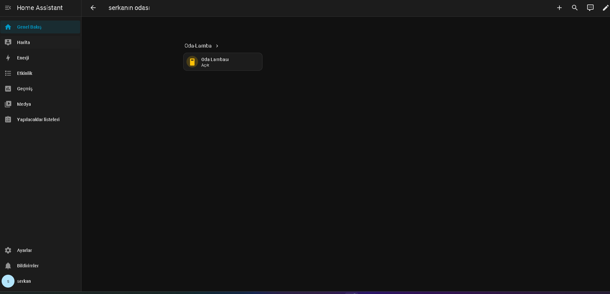
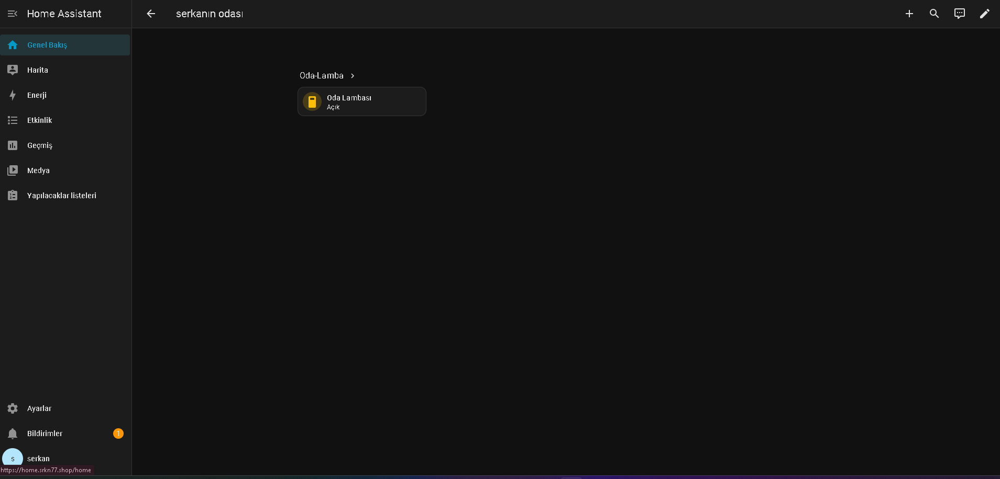
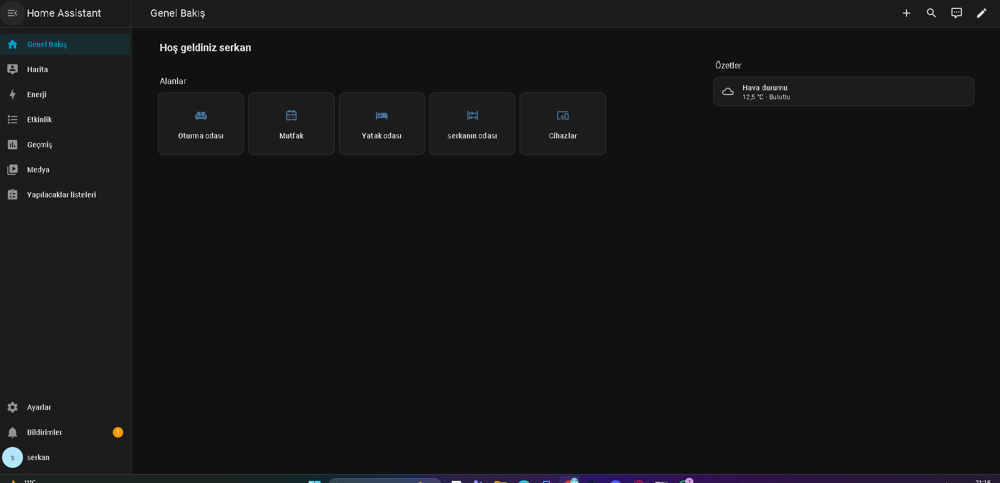
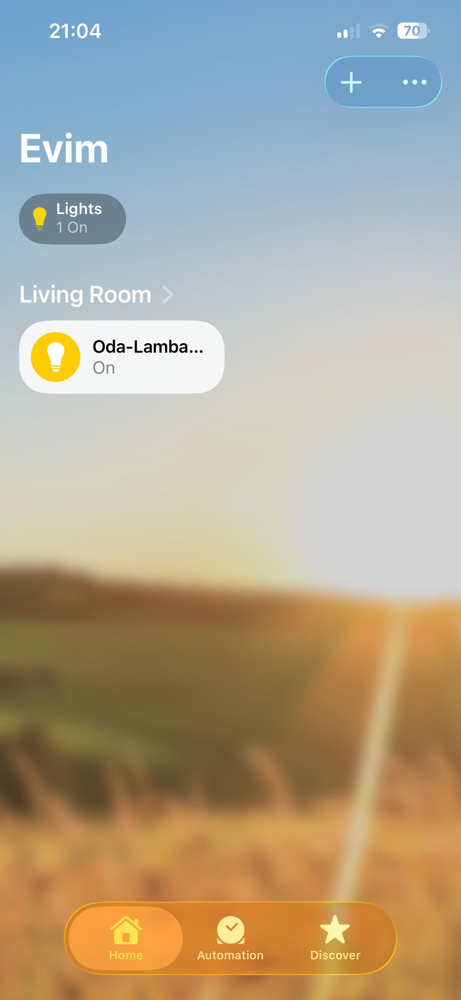

# 🏠 ESP32 Home Automation System (Siri + Home Assistant + Cloudflare)

Control your home devices using ESP32 with full Siri voice integration via Home Assistant.
This system is self-hosted on a Linux server and securely exposed using Cloudflare Tunnel.

---

## 🚀 Features

* 🍏 Siri voice control (Apple Home)
* ⚡ Real-time light control via ESP32
* 🔐 Encrypted communication (ESPHome API)
* 🌐 Remote access via Cloudflare Tunnel
* 🖥️ Self-hosted Home Assistant (Docker)
* 📡 Local-first architecture (no cloud dependency)

---

## 🧠 System Architecture

ESP32 → WiFi → Home Assistant (Docker) → Cloudflare Tunnel → Apple Home (Siri)

---

## 📸 Screenshots

### 🖥️ Home Assistant Dashboard



### 🏠 Room Control



### 📊 Overview Panel



### 🍏 Apple Home (Siri Control)



---

## 🔌 ESP32 Configuration (ESPHome)

```yaml
esphome:
  name: oda-lamba

esp32:
  board: esp32dev

wifi:
  ssid: "YOUR_WIFI"
  password: "YOUR_PASSWORD"

api:
  encryption:
    key: "YOUR_API_KEY"

switch:
  - platform: gpio
    pin: 23
    name: "Room Light"
    inverted: true
```

---

## 🖥️ Server Setup (Ubuntu + Docker)

Install Docker:

```bash
sudo apt update && sudo apt install docker.io -y
```

Run Home Assistant:

```bash
sudo docker run -d \
  --name homeassistant \
  --restart=unless-stopped \
  -p 8123:8123 \
  ghcr.io/home-assistant/home-assistant:stable
```

---

## ☁️ Cloudflare Tunnel (Secure Remote Access)

```bash
cloudflared tunnel login
cloudflared tunnel create homeassistant
cloudflared tunnel route dns homeassistant yourdomain.com
cloudflared tunnel run homeassistant
```

---

## 🍏 Apple Home Integration

1. Open Home Assistant
2. Add **HomeKit Bridge** integration
3. Scan QR code using Apple Home app

Now you can say:

👉 “Hey Siri, turn on the room light”

---

## 🔐 Security Notes

* Never share your WiFi credentials
* Keep API keys private
* Do NOT expose ports directly (use Cloudflare Tunnel)

---

## 💡 Future Improvements

* Multi-room control
* Sensor integration (temperature, motion)
* Mobile dashboard

---

## 👨‍💻 Author

Developed by Serkan
